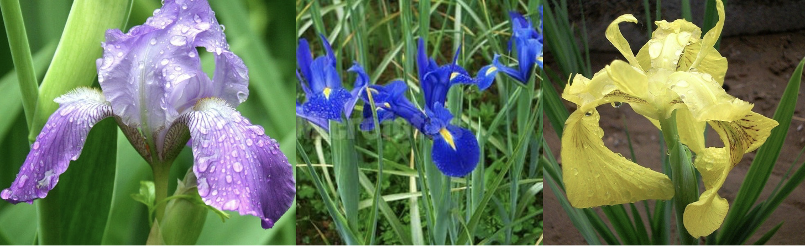

```{r setup, include=FALSE}
## Global options
knitr::opts_chunk$set(cache = TRUE, collapse=TRUE, 
                      comment="", prompt=TRUE)
```

# **项目介绍及分析**
## **项目介绍**

这是我的第一份R markdown笔记，目标是分析R语言中非常经典的'iris'（鸢尾花）数据集。

```{r 图一鸢尾花, fig.width=6, fig.height=4,echo=FALSE, fig.cap="Fig.1 鸢尾花(iris)", fig.align="center"}

```

'iris'数据集包含3种鸢尾花（Setosa, Versicolor, Virginica）各50个样本数据。每个样本测量了四种特种：
*花萼长度（Sepal.Length）*
*花萼宽度（Sepal.Width）*
*花瓣长度（Petal.Length）*
*花瓣宽度（Petal.Width）*
```{r 图二花瓣花萼, out.width="40%", out.height="40%",echo=FALSE, fig.cap="Fig.2 花瓣花萼示意图", fig.align="center"}

```

## **查看数据基本信息**
```{r summary-and-head}
# 使用 summary() 函数获取每个变量的统计摘要
summary(iris)

# 使用 head() 函数查看数据集的前6行
head(iris)
```

## **初步发现**
从上面的`summary()`结果可以看出：
1.  `Species`（种类）一共有三个类别，每个类别各有50个观测值。
2.  我们可以看到四个数值型特征的最大值、最小值、中位数和均值等信息。
`head()`的结果则让我们更直观地看到了数据的结构。

## **数据可视化**
```{r scatter-plot, fig.cap="Fig.3 鸢尾花花萼长度与宽度的关系图"}
# 使用 plot() 函数创建散点图
# col=iris$Species 可以让不同种类的花显示为不同颜色
# 先设置中文字体，确保绘图设备正常初始化
par(family = "Arial Unicode MS")  # 
plot(
  x = iris$Sepal.Length, 
  y = iris$Sepal.Width,
  xlab = "花萼长度 (cm)",
  ylab = "花萼宽度 (cm)",
  main = "鸢尾花花萼长度 vs 宽度",
  col = as.integer(iris$Species),  # 明确使用数字索引颜色
  pch = 1
)

legend(
  "topright",
  legend = levels(iris$Species),
  col = 1:3,  # 对应三个物种的颜色
  pch = 1,
  title = "物种"
)
```

## **散点图分析**

上图（Fig.3：鸢尾花花萼长度与宽度的关系图）清楚地显示了：
* 黑色的点（Setosa）明显与其他两种花区分开，它的花萼长度较短，但宽度较大。
* 红色（Versicolor）和绿色（Virginica）的点有一些重叠，但总体上也能看出一些趋势。

# **总结**
这份笔记的意义在于对入门的R markdown的代码进行实操，并且初步适应代码+笔记的笔记记录方式。在未来的数据分析中会一定遇到更多的问题，届时再逐一解决。

---

